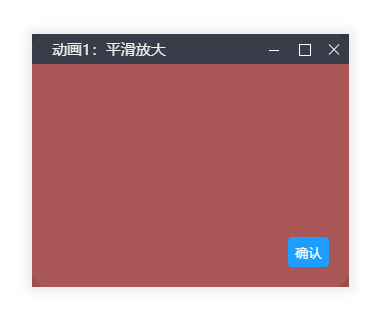

# Summer-UI
## 类似window窗口的弹窗和自定义的滑动条
测试页面 https://642661520.github.io/Summer-UI/build/index
### 1.窗口

#### 1.1 功能
最大化、最小化、4角拉伸、点击置顶
#### 1.2 使用
##### 引入
```
import sui from './modules/sui'
```
##### 创建新窗口
```
sui.suibox.open({content: element}) 
```
#####  content为必传参数：
jq对象，dom对象，class，id，文本
##### 可传参数：
```
type :窗口类型（0：消息框，1：普通窗口）,
title ：标题栏（false，文本）
move ：可移动区域默认为标题栏'.sui-suibox-title',
moveOut 是否可以移动到视口外，布尔值,
resize ： 是否可以移动，布尔值,
minHeight ： 拉伸最小高度：默认200,
minWidth ： 拉伸最小宽：默认200,
offset ：初始大小：默认为content对象的高宽'auto',
anim ： 进入移出动画类型：默认0（0：平滑放大，1：从上掉落，2：从最底部往上，3：从左滑入，4：从左翻滚，5：渐显，6：抖动）,
fixed ： 默认绝对定位true,或相对定位
closeBtn ： 关闭按钮类型：默认1（0：不现实，1：普通，2：圆角）,
maxmin = 最大化最小化按钮：true,
//shrink ： false,
btn ： '确认',
btncallback ： [],
//theme,
area ： 'auto',
//cancel,
success = function () {},
end = function () {},
moveEnd = function () {},
resizeEnd = function () {},
full = function () {},
min = function () {},
restore = function () {}
```
### 2.自定义滑动条

#### 2.1 功能
##### 自定义滑动条，窗口或指定元素
#### 2.2 使用
##### 引入
```
import sui from './modules/sui'
```
##### 为视口添加自定义滑动条
```
sui.suiscrollbarbody.open({background:undefined})
````
##### 为指定元素添加自定义滑动条
```
sui.suiscrollbar.open({
  content: '.testscroll',
});
```
